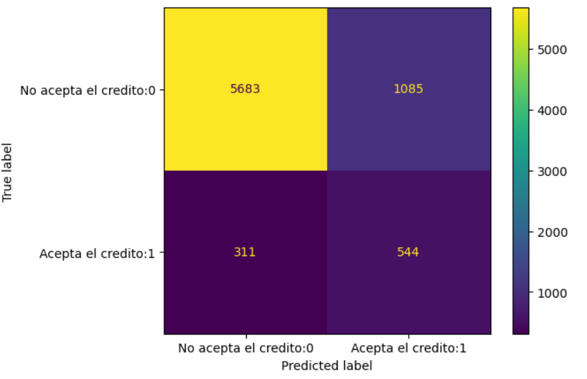

# Informe de salida

## Resumen Ejecutivo

Este informe describe los resultados del proyecto de machine learning donde se creó un clasificador para separar los clientes de un banco en posibles clientes de nuevos créditos y no, para luego y desplegarlo, a través de un puerto local, para su uso por parte del banco y de esta manera generar camapañas de marketing asociadas al grupo positivo (si aceptación de nuevos creditos). 

## Resultados del proyecto
En este proyecto se obtuvieron los siguientes logros y entregables:
* Se crearon paquetes de preprocesamiento, selección y transformación de acuerdo a lo encontrado en el análisis exploratorio de los datos (EDA), estos permiten que los datos que sean pasados al modelo correctamente y que no contengas rangos erróneos en el valor de las características. 
* Del análisis exploratorio de los datos (EDA) se logro identificar correlaciones en las variables y de esta manera reducir el número de características asociadas a cada cliente, lo cual, mejorar la eficiencia del modelo clasificador.
* Las transformaciones de los datos utilizan modelos de machine learning que se encuentran dentro de la carpeta **/home/leomorya/proyecto_final_metodologias/tdsp_template/src/nombre_paquete/preprocessing/Modelos_utilizados_preprocesamiento**, para ser utilizados por las funciones de transformación
* Con las funciones de preprocesamiento, selección y transformación se pueden crear nuevos dada set para ser estudiados por los analistas de datos 
* Como modelo base se utilizo la regresión logística 
* el modelo de clasificación final fue random forest, este mejoro las métricas de desempeño del modelo base
* los modelos creados de clasificación se encuentran en la carpeta **/home/leomorya/proyecto_final_metodologias/tdsp_template/src/nombre_paquete/models**
* finalmente se construyo una API sobre la libreria FastAPI para desplejar el modelo en un puerto local, en esta API solo es necesario cargar un archivo. csv cpn los datos tabulares y el arroja el valor de la calasificación para cada instancia o cliente 
* El archivo. py con el api se encuentra en **/home/leomorya/proyecto_final_metodologias/tdsp_template/src/nombre_paquete/deployment**

Los resultados de la evaluación del modelo base y final son:

|modelo|calsificador|clase|precisión|recall|f1_score|
|:---:|:---:|:---|:---|:---|:---|
|base|regresión logistica|positiva:1|0.33|0.64|0.44|
|base|regresión logistica|negativa:0|0.95|0.84|0.89| 
|final|random forest|positiva:1|0.38|0.63|0.47|
|final|random forest|negativa:0|0.95|0.87|0.91| 

vemos como las métricas del modelo final son mejores, veamos ahora sus respectivas matrices de confusión:

###Modelo base Matriz de confusión

###Modelo final Matriz de confusión

Como se observa en las métricas anteriores y en las matrices de confusión del modelo base y final, el modelo final demostró un rendimiento superior para todas sus métricas, la más importante de estas métricas en concordancia al problema de establecer que clientes tomarán nuevos créditos es la precisión de la clase positiva, ya que nos da la probabilidad de que un cliente que el clasificador clasifique en dicha clase tome o no un crédito, su valor es de 38% el cual, es un valor bastante alto con respecto al valor aleatorio del problema en sis mismo, cuyo valor esta alrededor del 11%.  Por tanto, el valor de desplegar el calificador en una API para el negocio es que se pueden generar campaña de marqueting especializadas para los clientes que sean clasificados positivamente y generar nuevos endeudamientos sobre estos.

## Lecciones aprendidas
Algunos de los problemas encontrados en relación al proyecto fueron:

* Datos con valores fue del rango real de la variación de la característica representada, esto se sorteo con la experticia de los analistas de datos propios del negocio 
* Desbalanceo muy alto entre la clase positiva (de mayor importancia) y la clase negativa, esto se sorteo utilizando técnicas de balance de clases propias de los modelos de sklearn
* Construcción de los path o rutas de los paquetes para que funcionen correctamente en las fases de entrenamiento y despleigue de los modelos, esto se sorteo utilizando rutas relativas cuidadosamente y con librerías como os 

Lecciones aprendidas, algunas fueron:
* El usos de versionamiento de código, a traves de git y github muy importante en el desarrollo del proyecto es fases y con versionamiento de codigo 
* La facilidad de uso de la herramienta FastAPI para el despliegue del modelo en un entorno local 

Recomendaciones:
* Mas comunicación entre el equipo interno del banco de análisis y el cientifico de datos para mejorar el estudio de datos atipicos en el preprocesamiento de los datos 
* Para futuros proyectos de se recomienda un estudio mas detallado de la características seleccionadas para realizar el entrenamiento del modelo, utilizando herramientas como sklearn.feature_selection, por tanto, mas tiempo en el análisis exploratorio de los datos

## Impacto del proyecto
En este caso al generar un modelo de clasificación fácil de usar, a través, de una API local utilizando los datos típicos de los clientes del banco, para segmentar dicho clientes en dos clases la uno o positiva (clientes que tomaran nuevos créditos) y la negativa, ayudara a banco a generar estrategias de contacto y marqueting a los clientes de la clase positiva, para generar nuevos endeudamientos a clientes con buena clasificación crediticia y por tanto, generar mayores entradas de liquides al banco. 

Para lograr futuras mejoras en los modelos de clasificación se debe llevar una interacción mayor entre el equipo de ciencia de datos y analista del banco, para generar un mejor procesos de análisis exploratorio de  los datos y selección de características 

## Conclusiones
Las principales conclusiones son:

* Se llevo exitosamente el análisis exploratorio y selección de características de los datos 
* se crearon paquetes o módulos de preprocesamiento, selección y transformación de los datos para su uso de entrenamiento  modelos de machine learning de clasificación y su posterior despliegue 
* Se entrenaron y evaluaron diferentes modelos de clasificación obteniendo el mejor desempeño en el modelo de random forest 
* El problema de clasificar si un cliente tomara o no un crédito, inicialmente contaba con una probabilidad de 11% al tomar un cliente al azar, con la construcción del modelo clasificador se obtuvo un desempeño del 38%, aumentando mas de tres veces la posibilidad que al escoger un cliente tome un nuevo crédito.
* Se creo un API con las librerías fastAPI que genera un despliegue local, donde solo se debe subir un archivo.csv con las características del cliente o el grupo de clientes para generar la inferencia del modelo (random forest "mejor modelo"), pudiendo clasificar satisfactoriamente el cliente en la clase positiva (valor:1) o negativa (valor:0)
* Se cumplieron todas las metas del proyecto planeado de machine learning, ademas, se desplegó el modelo en un API local

## Recomendaciones 
Las siguientes son las recomendaciones:
* En un futuro proyecto crear los módulos o paquetes creados específicamente para el proyecto con librerías como Poetry, para evitar complicaciones con rutas relativas y absolutas (Paths).
* Aumentar el tiempo de análisis exploratorio de datos, para tratar de mejorar el desempeños de los modelos creados 
* Realizar monitorio mensual, para evitar posibles drift en los datos o el modelo.

## Agradecimientos
- Agradecimiento al banco XXX por contratarme y darme la oportunidad de realizar este proyecto.
- Agradecimientos al equipo de trabajo y técnicos, así como, a los Stakeholders

