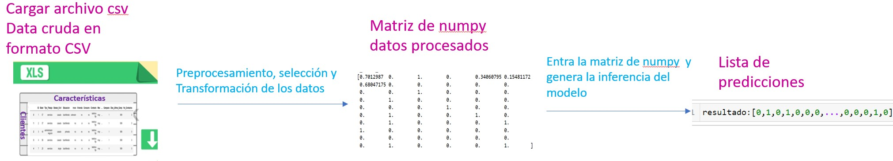

# Despliegue de modelos

## Infraestructura

- **Nombre del modelo:** Clasificador de aceptación de créditos con Random forest.
- **Plataforma de despliegue:** El modelo será desplegado en un servidor local usando FastAPI sobre el puerto 8000.
- **Requisitos técnicos:** 
    - *versión de Python:* python 3.10.7
    - *Librerias:* fastapi(0.98.0), numpy(1.23.5), sys, pandas(1.5.2), scikit-learn(1.2.2), joblib 1.2.0,io 
    - *Software:* Linux base OS (Ubuntu 22.10 Linux X86_64), kernel 5.19.0-45 Ubuntu
    - *Hardware:* CPU: i7 9700k (8) @ 3.600GHz, GPU: NVIDIA GeForce RTX 3070, RAM: 48 gb
- **Requisitos de seguridad:** Al tratarse de datos previamente que an sido utilizados para examenes a candidatos de cientifico de datos, los datos pueden ser públicos y no necesitan seguridad  
- **Diagrama de arquitectura:**

## Código de despliegue

- **Archivo principal:** El codigo para despleigue del modelo se encuentra en *depliegue.py*, el cual, corre el API con FastAPI
- **Rutas de acceso a los archivos:** El código puede encontrarse en *'src/nombre_paquete/deployment/despliegue.py'*[link](https://github.com/Leomorya/-MLDS6project/blob/entrega_cuatro/src/nombre_paquete/deployment/despliegue.py)

## Documentación del despliegue

- **Instrucciones de instalación:** Se debe instalar pip y las librerias mencionadas en requisitos técnicos para su correcto funcionamiento y despliegue   
- **Instrucciones de configuración:** Teniendo en cuenta se realizo validaciones cruzadas y búsqueda de hiperparámetros en la dcreación del modelo inferencial o clasificador, no hay necesidad de configurara nada.
- **Instrucciones de uso:** El despliegue del modelo consta de dos pasos
    - *Despliegue del servidor:* Se pone en producción la aplicación creada, para ello ejecutar.
          - uvicorn {main_file_path}:app --reload 
          - cargar los datos en un archivo csv que tiene formato tabular con las caracteristicas generales de los clientes para generar las inferencias, el API inferira 0 si el cliente no acepta creditos nuevos o 1 si acepta creditos nuevos  

