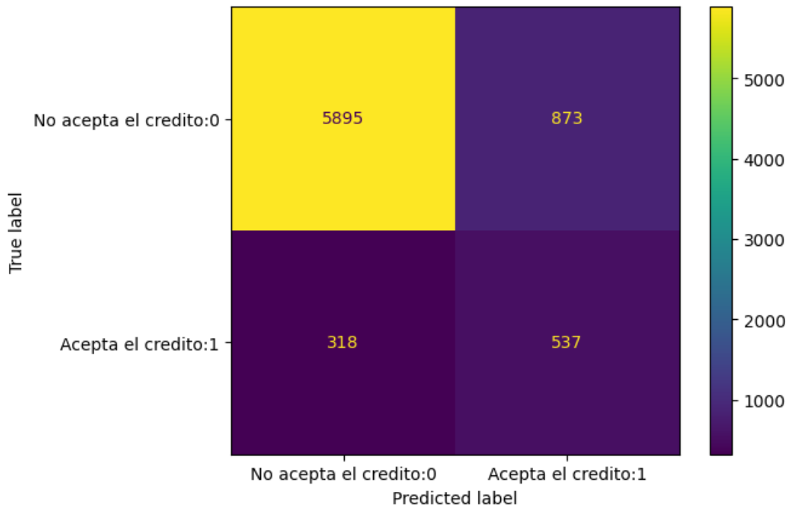

# Reporte del Modelo Final

## Resumen Ejecutivo

## Descripción del Problema

Teniendo en cuenta que se quiere predecir si un cliente determinado tomara o no un crédito y que el modelo base que se utilizó fue la regresión logística, se decidió que se probarían más modelos de machine learning con el fin de aumentar las métricas de evaluación obtenidas, ya que una de estas nos da la probabilidad si un cliente tomara o no un crédito si está en la clase positiva (aceptación de crédito),  esta métrica es la precisión, puesto que se define como pres=TP/(TP+FP).

## Descripción del Modelo

Los modelos basados en árboles de decisión son bastante fiables o precisos cuando se trata de scoring crediticio, por tanto, se probaron los árboles de decisión (random forest), obteniendo mejoras en todas las métricas y en la más importante la precisión.
La metodología que se utilizó para encontrar este modelo fue variación de hiperparámetros y validación cruzada utilizando como metrica de ranking o score el f1_score debido al desbalance de clases,  encontrando el siguiente conjunto de hiperparámetros 

mejores_parametros_rf={'class_weight': 'balanced_subsample',
 'criterion': 'entropy',
 'max_depth': 10,
 'max_features': 'sqrt',
 'max_leaf_nodes': 50,
 'n_estimators': 50,
 'random_state': 0}

finalmente se entreno el modelo con estos hiperparámetros y con todos los datos aportados en el archivo train. 

## Evaluación del Modelo

Las métricas de evaluación que se obtuvieron fueron:

|modelo final|clase|precisión|recall|f1_score|
|:---:|:---|:---|:---|:---|
|random forest|positiva:1|0.38|0.63|0.47|
|random forest|negativa:0|0.95|0.87|0.91| 

También se presenta la matriz de confusión

## Conclusiones y Recomendaciones

Del modelo final se tiene:

* el modelo de linea base fue superado en capacidad de generalización por el modelo de random forest 
* las métrica precisión nos da la probabilidad de que un cliente de la clase positiva tome un crédito realmente 
* el modelo obtenido es pequeño y fácil de transportar o cargar para poner en producción
* las características de entrada del modelo deben ser las mismas que los datos usados en train 
* se debe monitoria el modelo por lo menos mensualmente para evitar posibles drift 

## Referencias
La unica referencia que se para este proyecto fue:
* Term Deposit Opening Decision / Classification Problem [Link del proyecto](https://medium.com/analytics-vidhya/term-deposit-opening-decision-f57776b88453)

